0. (part 1) The goal of this level is for you to log into the game using `SSH`. The host to which you need to connect is **bandit.labs.overthewire.org**, on port **2220**. The username is **bandit0** and the password is **bandit0**. 

**Solution:**

By SSH'ing into the first game room using the provided username bandit0 and password bandit0, we are granted access. We can use the `-p` flag to specify a port.

**Commands:**

`ssh -p`: secure shell remote login into a specific port
`bandit@bandit.labs.overthewire.org`: username@address
`
**Output:**

This room automatically puts us into room 1 after logging in.

---

0. (part 2) The password for the next level is stored in a file called readme located in the home directory.

**Solution:**

By typing the`ls`command, we can see one file in our directory named "readme". We can use cat to read the contents of this file.

**Commands:**

`ls`: List all files and folders in current directory
`cat`: Print out file contents

**Output:**

--- 

1.  The password for the next level is stored in a file called - located in the home directory
   
**Solution:**

Attempting to read a file that is called "-" will result in `cat` treating it as an argument which prevents us from reading it. By using `cat` followed by `./` we can view the files contents.

`./`: refers to the current directory

**Output:**
 

---

2. The password for the next level is stored in a file called --spaces in this filename-- located in the home directory

**Solution:**

In order to read a file containing spaces in it's filename, we need to enclose the file within quotation marks as well as adding `./` at the start to ensure that the `cat` command doesn't recognise it as an argument. 

`cat ./"--spaces in this filename--"`

**Output:**

---

3.  The password for the next level is stored in a hidden file in the **inhere** directory.

**Solution:**

First we `cd` into the folder **Inhere** and then use `ls` to display all files. As you can see in the output, nothing is shown. In order to see hidden files we need to add the `-a` flag to show hidden files. Once we have the filename, we can use `cat` on it.

`cd`: change directory
`ls -a`: show hidden files

**Output:**

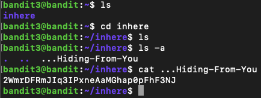

---

4. The password for the next level is stored in the only human-readable file in the inhere directory. Tip: if your terminal is messed up, try the “reset” command.

**Solution:**

To find the only human-readable file, we can use the `file` command to read the file contents.

`file:`identifies file types by examining their content rather than their file extensions

**Output:**

---

5. The password for the next level is stored in a file somewhere under the inhere directory and has all of the following properties: human-readable, 1033 bytes in size, not executable

**Solution**

We can use the `find` command along with the `-executable`, `-size`, and `-readable` flag to find the password. Once we have the directory, we can use `cat` to read the file.

`find ! -executable -size 1033c -readable

`
`find ! -executable`: Searches for files that are not executable, by adding a `!` before the flag
`find -readable`: Searches for human readable size
`find -size`: Searches for files with a specific size, followed by the type. i.e 1033c (1033 btyes)

**Output**

---

6. The password for the next level is stored somewhere on the server and has all of the following properties: owned by user bandit7, owned by group bandit6, 33 bytes in size

**Solution:**

Similar to the last room, we need to use the `find` command to search for the file containing the password. We can use the `-user` and `-group` as well as the `-size` flag to look for the file. 

The question states that the file is stored "somewhere on the server" so in order to find it , we can use `/` to look for the file starting from the root directory (searches entire server). 

`find / -user bandit7 -group bandit6 -size 33c`

`/`: Search from root directory (search entire server)
`find -user`: Search for files owned by a user
`find -group`: Search for a files owned by a group

After the search results return, we have a lot of results with all but one of them requiring permission to access.

Hidden among these is the only accessible file, by reading this file, we can get the answer

**Output:**

---

7. The password for the next level is stored in the file data.txt next to the word millionth

**Solution:**

In order to find the password, we can use `grep` to search for for the word 'millionth' within the file.

`grep millionth data.txt`

`grep`: Searches files for text patterns

**Output:**

---

8. The password for the next level is stored in the file **data.txt** and is the only line of text that occurs only once.

**Solution:**

In order to solve this, we can use the `sort` command to sort the lines into lexicographical order. Then we can use the piping command `|` to pass the sorted lines into the next command which will remove extra duplicate lines and keep a single copy of unique lines. the `-u`flag will keep lines that only occurred once originally.

`sort data.txt | uniq -u`

`sort:` sort in lexicographical order
`" | " , "piping"`: takes output of command on left and uses as input on right
`uniq -u:`removes extra duplicates and keeps a copy, `-u` keeps only lines that occurred once originally before uniq.

**Output:**

--- 

9. The password for the next level is stored in the file **data.txt** in one of the few human-readable strings, preceded by several ‘=’ characters.

For this task, we can use `grep` to search for == using the `-a` flag to tell grep to treat the file as it was readable text.

**Solution:**

`grep "===" data.txt -a`

- `grep -a`: treat file as if it was readable text.

**Output:**

As you can see, the password for the next room is split between the last and second last line.

---

10. The password for the next level is stored in the file **data.txt**, which contains base64 encoded data.

When using `cat` on **data.txt**, the base64 encoded data is shown.  We can decode this using the `base64` command in `--decode mode` using `<<<` to pass the base64 straight in.

`Base64`: encodes or decodes data using base64
`--decode:`base64 decode mode
`<<<`: Passes string directly as an input to the command instead of reading a file

**Solution**

base64 --decode <<< base64 string

**Output**

--- 

11. The password for the next level is stored in the file **data.txt**, where all lowercase (a-z) and uppercase (A-Z) letters have been rotated by 13 positions

 When reading the **data.txt** file, we can see that the password is contained within the caesar cipher shown below, requiring a rotation by 13 positions. To get around this, we can use the `tr` (translate) command.

`"Gur cnffjbeq vf 7k16JArUVv5LxVuJfsSVdbbtaHGlw9D4"` 

**Solution**

`tr 'A-Za-z' 'N-ZA-Mn-za-m' <<< " Gur cnffjbeq vf 7k16JArUVv5LxVuJfsSVdbbtaHGlw9D4"`

`tr`: translate command
`'A-Za-z'`: take all uppercase and lower case
 `'N-ZA-Mn-za-m'`: uppercase and lower case shift the alphabet by 13 places

**Output**

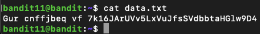

--- 

12. The password for the next level is stored in the file **data.txt**, which is a hexdump of a file that has been repeatedly compressed. For this level it may be useful to create a directory under /tmp in which you can work. Use mkdir with a hard to guess directory name. Or better, use the command “mktemp -d”. Then copy the datafile using cp, and rename it using mv.

**Solution** 

As this task requires the creation of new files, we need a temporary directory to store them so we use `"mktemp -d"` and then use `cp` copy the hexdump to the new directory.

Knowing that `data.txt` is a hexdump, we can use `xxd -r` on the hexdump to reverse it's contents back into the original binary. Doing that we get this which isn't the answer.

 The question gives us a clue that the hexdump was compressed, so by checking the file type, we can see the compression tool used on it which was `gzip`
 

In order to decompress the gzip, we need to add `.gz` to reversed_hex using `mv` so that the gzip tool is able to decompress it. Note that adding a file extension is only necessary for .gz archives.

Now we decompress it using the `-d` flag. Upon doing this and checking the file type, we discover the file is still compressed by a different compression tool (`bzip2`).

Decompressing using bzip2 and using file shows it's further compressed using gzip.

Decompressing further...

The next compression software used is `tar` so we use `"tar -xvf"` to decompress the file which produces `data5.bin` this time.

`"-x"` Decompresses
`"-v"` List files extracted from archive
`"-f"` Specify the filename to be decompressed (reversed_hex)

The next decompress cycle requires tar once again, then bzip2, tar, gzip in that order. 

The final decompression produces an ASCII text file containing the password to the next level...

`mktemp -d`: Creates a temporary directory with a unique name,
`mv`: move or rename files
`cp`: copy files or directories
`xxd -r`: creates a hex dump of a file, `-r` reverses it.
`gzip -d`: gzip compression tool, `-d` decompresses gzip archives
`bzip2 -d`: bzip compression tool, `-d` decompresses bzip archives
`tar -xvf`: tar compression too, extracts files from tar archives, `-x` extracts, `-v` verbose mode, `-f` specifies the filename to extract

**Output**

--- 

13. The password for the next level is stored in **/etc/bandit_pass/bandit14 and can only be read by user bandit14**. For this level, you don’t get the next password, but you get a private SSH key that can be used to log into the next level. **Note:** **localhost** is a hostname that refers to the machine you are working on

Since the bandit14 file in **bandit_pass** can only be accessed by the bandit14 user, our objective is to log in as that account. We are provided with an SSH private key for authentication, so the first step is to find the key's path so that it can be inputted into the bandit14 ssh command.

**solution**

Taking the file path, we can use the command below to ssh in as bandit14. 

`**bandit13@bandit**:**~**$ ssh -p 2220  -i '/home/bandit13/sshkey.private' bandit14@bandit.labs.overthewire.org`

Once in, we cd to /etc/bandit_pass to `cat` bandit14 to find the password.

`realpath`: shows full file path of a file or directory

**Output**

--- 

14. The password for the next level can be retrieved by submitting the password of the current level to port 30000 on localhost.

This task requires us to interact with port 30000. Using `netcat`, we can send a message containing the current level’s password to port 30000 on `localhost` , which will return the password for the next level.

**Solution**

`nc localhost 30000`

`nc`: netcat tool
`localhost 3000`: specifying the ip (localhost in this instance) as well as the port

**Output**

--- 

15. The password for the next level can be retrieved by submitting the password of the current level to port 30001 on localhost using SSL/TLS encryption.

This task requires us to send the current level’s password to port 30001 on localhost, but unlike the previous challenge, the connection must use SSL/TLS encryption. `NC` does not support this so we have to use `openssl` 

**Solution**

 

`openssl`: tool for working with SSL/TLS protocols, certificates, and cryptography
`s_client`: command that acts as a client to connect to a TLS/SSL server
`-connect localhost:30001`: specify ip/port

**Output**

 

---

16. The credentials for the next level can be retrieved by submitting the password of the current level to a port on localhost in the range 31000 to 32000. First find out which of these ports have a server listening on them. Then find out which of those speak SSL/TLS and which don’t. There is only 1 server that will give the next credentials, the others will simply send back to you whatever you send to it. 

**Solution:**

The first part of this task is to conduct an`nmap` scan to find any listening ports. The following command can be used to do so.

`nmap -p 31000-32000 localhost`

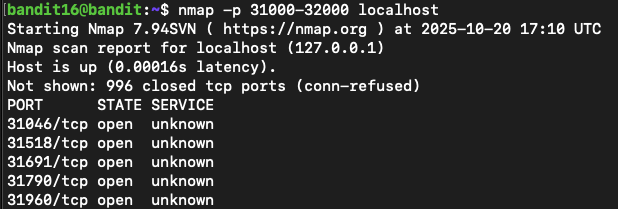

From the 5 ports found, we can now manually send the password of the current level to each one to find a response. This can be done in a similar fashion to the previous question by using `openssl` in the same fashion. 

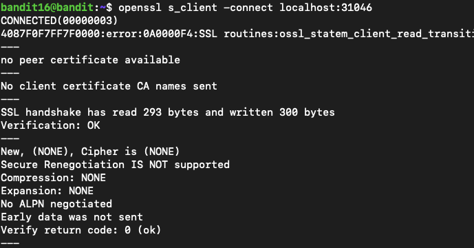

As we can see above, when connecting to the wrong one, we are returned with nothing and the connection ends. A similar result occurs when connecting to ports **31691** and **31960** however, when connecting to ports **31518** and **31790**, a connection is established.

Upon pasting the password for the current level to both **31518** and **31790**, we are returned with this:

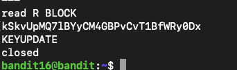

This isn't the password, and when referring to the level instructions, we see this.

Referring to the [openssl](https://docs.openssl.org/3.0/man1/openssl-s_client/#options) man page, we can see that the `-quiet` and `-ign_eof `flags can be tried.

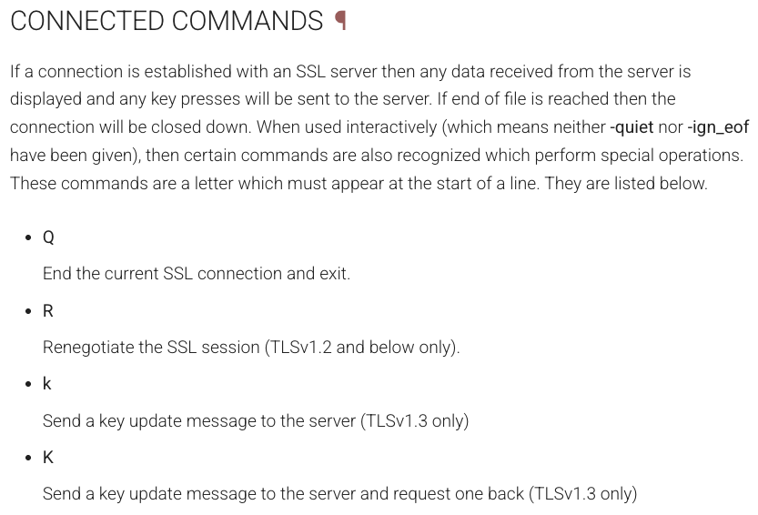

Note that when connecting to the ports that previously did not connect (**31046, 31691, 31960**), using the two new flags results in an error.

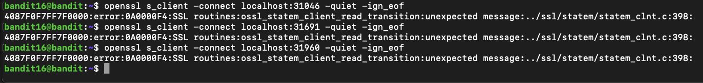

Trying the new flags on the other two ports returning "KEYUPDATE":

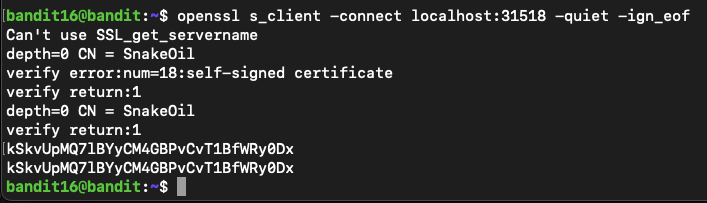

When inputting the current password into port 31790, we get a private key instead of the password. We can use this key to SSH into the next level.

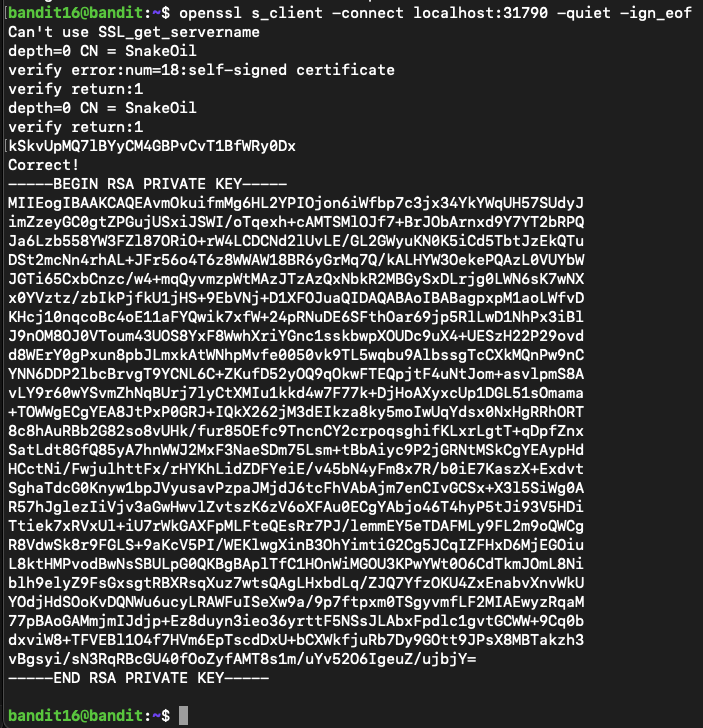

To use this key, we need to save it to our desktop. We can do this by using `cd` to access our desktop directory, then by using `nano` we can save the key using the **.pem** file format. 

To SSH, we can use the flag `-i` followed by the file path to the key as well as the ssh username and address.

`ssh -i /Users/jake/Desktop/key17.pem -p 2220 bandit17@bandit.labs.overthewire.org`

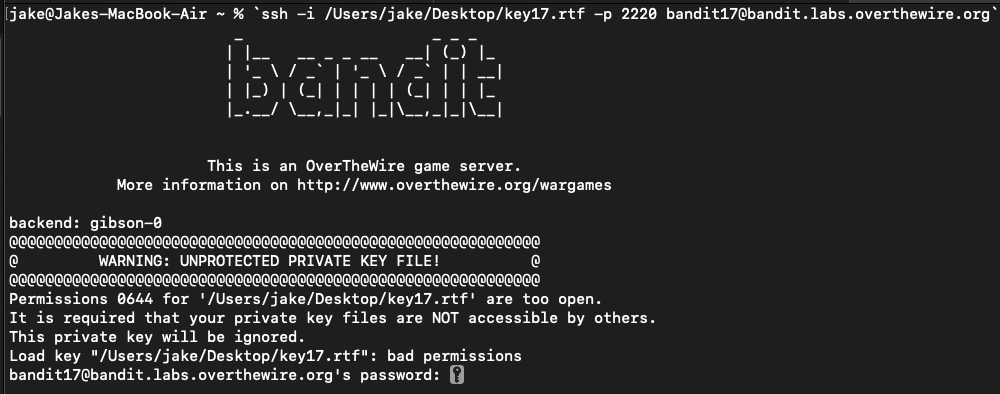

Unfortunately, our private key is recognised as being 'unprotected' and has permission 644. By doing a quick search online, permission 644 means that the owner gets read and write (6), the group gets read (4), and everyone else gets read permission (4).

However for a private key, only the owner should have access and therefore we should use chmod [600](https://superuser.com/questions/779157/ssh-permissions-0644-for-my-key-pub-are-too-open) as the file permission.

We can set permission 600 by using the command `chmod 600 key17.pem`.

`nmap`: network analyser that sends packets and analyses responses
`-p`: specify a port, in this instance we are specifying a range

`-quiet` (openssl): Suppresses extra output in s_client, showing only essential connection info. This suppress the internal handling of KEYUPDATE which would normally close the connection.
-`ign_eof` (openssl): Tells s_client to ignore EOF from the server, keeping the session open.

`chmod 600`:  Sets file permissions so only the owner can read/write

`ssh -i`: Specify a private key file for SSH authentication instead of using a password

Now we can SSH into the next room!

**Output**

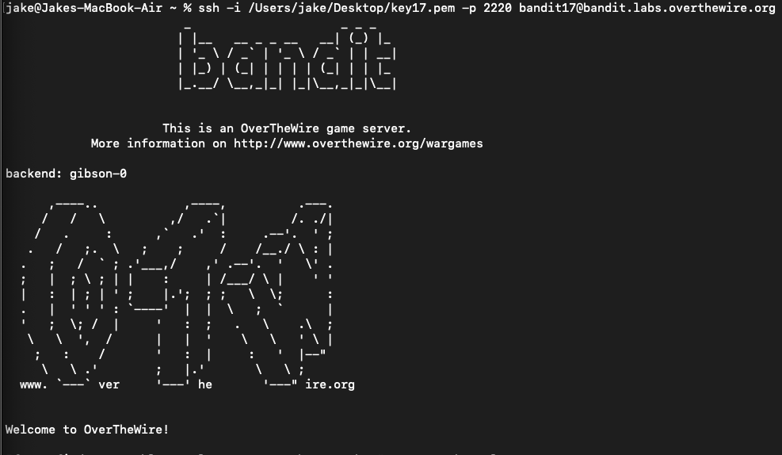

--- 

17. There are 2 files in the homedirectory: **passwords.old and passwords.new**. The password for the next level is in **passwords.new** and is the only line that has been changed between **passwords.old and passwords.new**

**NOTE: if you have solved this level and see ‘Byebye!’ when trying to log into bandit18, this is related to the next level, bandit19**

**Solution:**

To solve this, we can use the diff command to find differences between the two files.

-`Diff`: compares two files, argument 1 (the first file) and argument 2 (the second file), and shows the differences between them.

**Output**: 

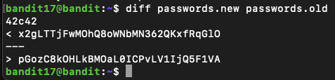

---

18. The password for the next level is stored in a file readme in the homedirectory. Unfortunately, someone has modified .bashrc to log you out when you log in with SSH.

**Solution:**

When attempting to SSH into this room we automatically get disconnected before we can execute any commands.

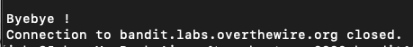

In order to bypass this we can use SSH to remotely execute commands by inserting them into the SSH arguments.

`ssh -p 2220 bandit18@bandit.labs.overthewire.org "ls"`

We can add a command in quotations and it will execute as shown below. 

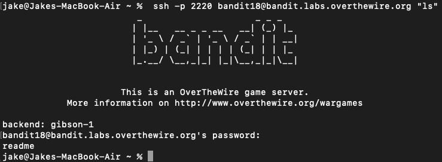

We can use the `cat` command to find the password to the next level by using this method. Note that using `~` points towards the home directory.

**Output:**

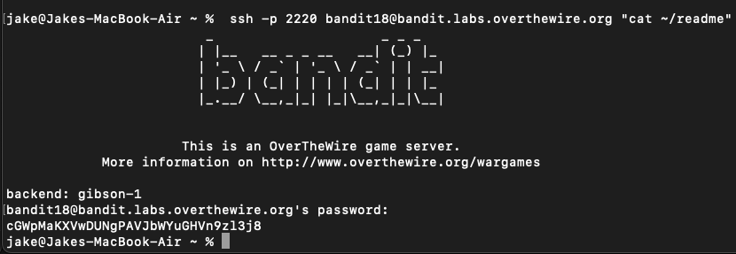

---

